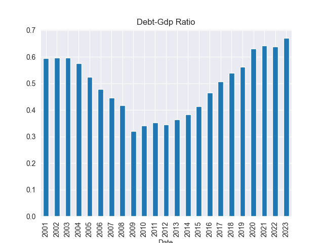

# 🇰🇪 Kenya Debt Analysis

> Time series analysis of Kenya's public debt and GDP using Python.

## 📌 Project Summary

This is my first project. It performs a comprehensive time series analysis of Kenya's public debt (both domestic and external) and its relationship with nominal GDP from 2001 to 2023.

The goal is to uncover trends, significant spikes, and patterns in Kenya’s debt levels and compare them against national economic growth — particularly using the **Debt-to-GDP ratio** and annual **percentage changes**.

---

## 📉 Sample Visualization



---

## 📊 Dataset Sources

- **Public Debt Data**: Monthly domestic and external debt (2001–2023)  
  [Download CSV](https://www.centralbank.go.ke/uploads/government_finance_statistics/1830075011_Public%20Debt.csv)

- **GDP Data**: Annual nominal and real GDP figures  
  [Visit Source](https://www.centralbank.go.ke/annual-gdp/)

> 📍 Original source: [Central Bank of Kenya](https://www.centralbank.go.ke/)

---

## 🧰 Tools Used

- **Python**
- **Pandas** – data manipulation
- **NumPy** – numerical operations
- **Matplotlib** and **Seaborn** – data visualization

---

## 🔧 Key Steps in the Analysis

### 🧹 Data Cleaning
- Removed irregular headers and rows
- Stripped whitespace from column names
- Converted debt values (strings with commas) into numeric format

### 🗓️ Datetime Handling
- Combined year and month columns into a single datetime column
- Set datetime as index to support time series analysis

---

## 📈 Analysis Summary

- Plotted trends in domestic and external debt
- Calculated year-on-year percentage changes
- Compared external vs domestic debt changes per year
- Joined debt and GDP data to calculate and visualize Debt-to-GDP ratio
- Observed monthly volatility patterns (especially post-2008)

---

## 🧠 Visual Insights

- Clear upward trend in both domestic and external debt since early 2000s
- External debt shows more frequent spikes, particularly after 2008
- Debt-to-GDP ratio rose significantly post-2009

---

## 🗞️ Real-World Context

Some debt surges correspond to major events:
- 2008 global financial crisis
- 2007/2008 post-election violence
- SGR infrastructure project (~2015)
- 2010 Constitution implementation

---

## 🔮 Future Work

- Adjust for inflation to compare real vs nominal debt
- Analyze debt servicing costs
- Add fiscal deficit trends for deeper context

---

## 🚀 How to Use

1. Clone the repository:
   ```bash
   git clone https://github.com/tabu-ley/Kenya-Debt-Analysis.git
   cd Kenya-Debt-Analysis
